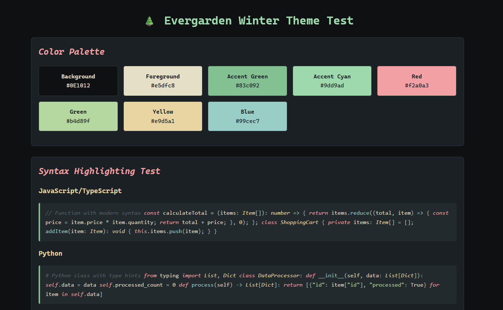

# Evergarden Winter - VS Code Themes

Cozy winter color themes for Visual Studio Code, inspired by the Evergarden color scheme. Perfect for long coding sessions with warm, nature-inspired palettes.

## 🎨 Available Themes

### 🌲 Evergarden Winter (Dark)
A cozy dark theme with deep forest backgrounds and warm beige tones.

### ❄️ Evergarden Winter Light  
A gentle light theme with warm paper backgrounds and soft forest accents.



## Features

- 🌲 **Dual theme support** - Both dark and light variants for all conditions
- 👀 **Excellent contrast** - Carefully tuned for readability in both modes
- 🎨 **Consistent colors** - Matches WezTerm and Alacritty configurations
- 💚 **Syntax highlighting** - Thoughtful colors for all major languages
- 🌙 **Easy on the eyes** - Designed for extended coding sessions
- 🔄 **Modern VS Code** - Full support for latest features and semantic highlighting

## Color Palette

Both themes use a carefully selected winter forest palette:

### Dark Theme
- **Background**: Deep forest green-grey (#232a2e -> #0E1012)
- **Foreground**: Warm beige (#e5dfc8)
- **Accent**: Soft aqua/green (#9dd9ad, #83c092)

### Light Theme  
- **Background**: Warm paper white (#f5f0e0)
- **Foreground**: Soft charcoal (#5a6268)
- **Accent**: Soft forest green (#83c092, #9dd9ad)

### Shared Syntax Colors:
- Red: #f2a0a3 (keywords, tags)
- Green: #b4d89f (strings)
- Yellow: #e9d5a1 (types, numbers)
- Blue: #83c092/#99cec7 (functions)
- Purple: #e5b5d1 (constants)
- Cyan: #9dd9ad (operators)

## Installation

### Method 1: Manual Installation (Recommended for custom themes)

1. **Locate your VS Code extensions folder:**
   - **Windows**: `C:\Users\YourUsername\.vscode\extensions\`
   - **macOS**: `~/.vscode/extensions/`
   - **Linux**: `~/.vscode/extensions/`

2. **Create the theme folder structure:**
   ```
   .vscode/extensions/evergarden-winter-1.0.0/
   ├── package.json
   └── themes/
       ├── evergarden-winter-theme.json
       └── evergarden-winter-light-theme.json
   ```

3. **Copy the files:**
   - Copy `package.json` to the root of the theme folder
   - Create a `themes` subfolder
   - Copy both theme files into the `themes` folder

4. **Reload VS Code:**
   - Press `Ctrl+Shift+P` (or `Cmd+Shift+P` on macOS)
   - Type "Developer: Reload Window"
   - Press Enter

5. **Activate the theme:**
   - Press `Ctrl+K Ctrl+T` (or `Cmd+K Cmd+T` on macOS)
   - Select either "Evergarden Winter" (dark) or "Evergarden Winter Light" from the list

### Method 2: Quick Settings.json (Alternative)

If you prefer, you can add custom colors directly to your `settings.json`:

1. Press `Ctrl+,` (or `Cmd+,` on macOS) to open Settings
2. Click the `{}` icon in the top right to open `settings.json`
3. Copy the entire contents of `evergarden-winter-theme.json`
4. Add it to your settings under `"workbench.colorCustomizations"` and `"editor.tokenColorCustomizations"`

## Matching Terminal Theme

This theme is designed to work seamlessly with the Evergarden Winter themes for:
- **WezTerm** (wezterm.lua)
- **Alacritty** (alacritty.toml)

All three use the exact same color palette for a consistent development environment!

## Customization

You can customize the theme by modifying the color values in `evergarden-winter-theme.json`. Some common customizations:

### Change background opacity
Add to your `settings.json`:
```json
"workbench.colorCustomizations": {
  "[Evergarden Winter]": {
    "editor.background": "#232a2eee"
  }
}
```

### Adjust font styles
Modify the `fontStyle` properties in the theme file:
- `"italic"` - Italicize text
- `"bold"` - Bold text
- `"italic bold"` - Both
- `""` - Remove styling

### Change accent color
Find and replace the accent color `#9dd9ad` with your preferred color throughout the theme file.

## Supported Languages

The theme includes optimized syntax highlighting for:

- JavaScript / TypeScript
- Python
- HTML / CSS / SCSS
- JSON
- Markdown
- And many more!

## Tips

- **Enable font ligatures** for an even better experience:
  ```json
  "editor.fontLigatures": true
  ```

- **Recommended fonts:**
  - JetBrains Mono
  - Fira Code
  - Cascadia Code

- **Enable semantic highlighting:**
  ```json
  "editor.semanticHighlighting.enabled": true
  ```

## Marketplace Publishing

### Prerequisites
- [Visual Studio Code Extension CLI](https://code.visualstudio.com/api/working-with-extensions/publishing-extension#publishing-extensions)
- [Microsoft Azure DevOps Account](https://marketplace.visualstudio.com/manage)

### Publishing Steps
1. Install VSCE: `npm install -g vsce`
2. Create publisher account at [VS Code Marketplace](https://marketplace.visualstudio.com/manage)
3. Login: `vsce login <publisher-name>`
4. Package: `vsce package`
5. Publish: `vsce publish`

### Extension Metadata
Update `package.json` with:
- Repository URL
- Publisher name
- Extension icon
- Marketplace categories
- Tags and keywords

## Contributing

Found an issue or have a suggestion? Feel free to customize the theme to your liking!

## License

MIT License - Feel free to modify and share!

## Credits

Inspired by:
- [Evergarden](https://github.com/everviolet/nvim) by everviolet
- [Everforest](https://github.com/sainnhe/everforest) by sainnhe
- [Nord](https://github.com/nordtheme/nord) color scheme

---

**Enjoy your cozy coding sessions!** 🌲❄️✨
